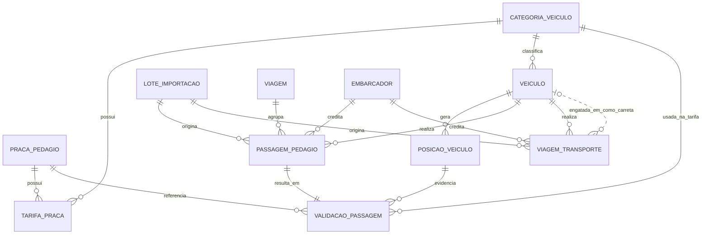

# Modelo de Dados

Draft de schema para revisão — nada aplicado ainda no Supabase. Todas as
tabelas usam PostGIS (`geometry`/`geography`, SRID 4326).

## Schema

Todas as tabelas abaixo vivem no schema **`pedagio`** (não `public`), no
mesmo projeto Supabase do sistema de tickets, para isolar objetos/permissões
dos dois projetos. Nomes completos: `pedagio.praca_pedagio`,
`pedagio.tarifa_praca`, etc. (o prefixo é omitido nas tabelas abaixo por
brevidade).

Pontos de atenção decorrentes disso:
- A extensão PostGIS é global ao banco (schema `extensions`/`public`
  dependendo de como já foi instalada) — não precisa reinstalar, só
  referenciar os tipos normalmente.
- Por padrão o PostgREST do Supabase só expõe o schema `public` via API. Se
  o frontend for consumir `pedagio.*` diretamente via API (em vez de só
  RPC/Edge Functions), é preciso adicionar `pedagio` em
  Settings → API → "Exposed schemas".
- RLS deve ser habilitada por tabela dentro do schema `pedagio` do mesmo
  jeito que no `public` — isolamento de schema não substitui RLS.

## Visão geral das entidades

## Tabelas

### `praca_pedagio`
Cadastro das praças e o polígono geográfico que delimita sua área de
cobrança/detecção.

| coluna | tipo | notas |
|---|---|---|
| id | uuid pk | |
| nome | text | |
| rodovia | text | |
| concessionaria | text | |
| km | numeric | opcional, referência |
| poligono | geometry(Polygon, 4326) | área usada na validação |
| sentido | text | opcional (norte/sul, ida/volta) |
| ativo | boolean | default true |
| created_at | timestamptz | default now() |

Índice: `GIST(poligono)`.

### `categoria_veiculo`
Categorias de eixos — usadas tanto para tarifação por composição total
(ex.: `EIXO_6` = cavalo + carreta comum) quanto para os eixos próprios de
cada veículo/carreta isolado (ex.: `EIXO_3` = cavalo sozinho ou carreta
comum; `EIXO_4` = carreta vanderleia). `quantidade_eixos` (FASE 16) é o
número real, usado por `pedagio.categoria_por_composicao` para somar a
composição em vez de constantes fixas no código.

| coluna | tipo | notas |
|---|---|---|
| id | uuid pk | |
| codigo | text unique | ex: "EIXO_6" |
| descricao | text | |
| quantidade_eixos | integer not null | eixos representados por esta categoria (FASE 16) |

### `tarifa_praca`
Histórico de valores por praça + categoria, com vigência — nunca faz
`UPDATE` do valor, sempre insere uma nova vigência.

| coluna | tipo | notas |
|---|---|---|
| id | uuid pk | |
| praca_id | fk praca_pedagio | |
| categoria_veiculo_id | fk categoria_veiculo | |
| valor | numeric(10,2) | |
| vigencia_inicio | date | |
| vigencia_fim | date null | null = vigente atualmente |

Constraint: sem sobreposição de vigência para o mesmo par
praça+categoria (via `EXCLUDE USING gist` com `daterange`).

### `veiculo`
Cadastro único de cavalo mecânico e carreta (FASE 16 — antes eram tabelas
separadas). `categoria_veiculo_id` significa os **eixos próprios** do
veículo/carreta (ex.: cavalo → `EIXO_3`, carreta vanderleia → `EIXO_4`).
`categoria_fallback_id` só se aplica a `tipo = 'cavalo'`: é a categoria de
tarifa usada quando a composição real (cavalo + carreta(s), via
`viagem_transporte`) não pôde ser determinada — antes da FASE 16 essa era
a única função de `categoria_veiculo_id`.

| coluna | tipo | notas |
|---|---|---|
| id | uuid pk | |
| placa | text unique | |
| tipo | text | `cavalo` \| `carreta` |
| categoria_veiculo_id | fk categoria_veiculo | eixos próprios do veículo/carreta |
| categoria_fallback_id | fk categoria_veiculo null | só para `tipo = 'cavalo'`; tarifa quando a composição não é conhecida |
| frota / empresa | text | opcional, se multi-frota |
| ativo | boolean | |

Só `tipo = 'cavalo'` deve ser resolvido como `veiculo_id` em
`passagem_pedagio`/`posicao_veiculo`/`viagem_transporte` (carretas nunca
passam pedágio nem carregam rastreador próprio) — os matches por placa na
importação filtram `tipo = 'cavalo'`.

### `posicao_veiculo`
Pings de GPS. Tabela de maior volume — particionar por mês (`data_hora`)
quando o volume justificar.

| coluna | tipo | notas |
|---|---|---|
| id | bigserial pk | |
| veiculo_id | fk veiculo | |
| geom | geometry(Point, 4326) | |
| data_hora | timestamptz | |
| fonte | text | `carga_arquivo` \| `api` |
| lote_importacao_id | fk lote_importacao null | quando vier de arquivo |
| created_at | timestamptz | default now() |

Índices: `GIST(geom)`, `(veiculo_id, data_hora)`.

### `lote_importacao`
Rastreabilidade de cada carga de planilha (passagens ou posições).

| coluna | tipo | notas |
|---|---|---|
| id | uuid pk | |
| tipo | text | `passagens` \| `posicoes_gps` |
| arquivo_nome | text | |
| usuario | text | quem importou |
| total_linhas | int | |
| total_erros | int | |
| created_at | timestamptz | |

### `passagem_pedagio`
Uma linha da planilha de passagens importada (formato real do fornecedor,
FASE 07).

| coluna | tipo | notas |
|---|---|---|
| id | uuid pk | |
| numero_fatura | text | número da fatura vindo da planilha, para rastreio |
| veiculo_id | fk veiculo null | null se placa não reconhecida |
| placa_informada | text | valor bruto da planilha (auditoria) |
| tipo_veiculo_informado | text | texto livre da planilha, só informativo (tarifa usa a categoria já cadastrada do veículo) |
| praca_id | fk praca_pedagio null | null se (praça, sentido) não reconhecidos juntos |
| praca_informada | text | valor bruto da planilha |
| sentido_informado | text | usado junto com praca_informada para casar com o cadastro |
| tipo_uso | text | `passagem` \| `contrato` — contrato nunca passa pela validação geo/tarifária |
| condicao | text | `debito` \| `credito` — sinal de valor_cobrado precisa bater com esta coluna |
| data_hora | timestamptz | montada a partir de data + horário da planilha |
| valor_cobrado | numeric(10,2) | negativo quando condicao = credito |
| viagem_informada | text | valor bruto da planilha (auditoria), opcional |
| viagem_id | fk viagem null | auto-cadastrado na importação (FASE 10) quando `viagem_informada` não é vazio |
| embarcador_informada | text | valor bruto da planilha (auditoria), opcional |
| embarcador_id | fk embarcador null | auto-cadastrado na importação (FASE 10) quando `embarcador_informada` não é vazio |
| lote_importacao_id | fk lote_importacao | |
| status_validacao | text | `pendente` (default) \| ... \| `nao_aplicavel` (linhas tipo_uso = contrato) |
| created_at | timestamptz | |

Constraint: `unique (placa_informada, data_hora, condicao, valor_cobrado)`
— evita duplicar a mesma linha ao reimportar um arquivo (débito e crédito
pareados da mesma passagem continuam distintos porque diferem em
`condicao`/`valor_cobrado`).

### `viagem` (FASE 10)
Auto-cadastrada na importação a partir de `viagem_informada` — sem tela
de cadastro manual, só existe pra dar FK e permitir filtrar/agrupar
passagens por viagem.

| coluna | tipo | notas |
|---|---|---|
| id | uuid pk | |
| numero | text unique | mesmo valor de `viagem_informada`, sem duplicar |
| criado_em | timestamptz | default now() |

### `embarcador` (FASE 10)
Auto-cadastrado na importação a partir de `embarcador_informada`. CNPJ é
o único campo editável manualmente (tela `/cadastros/embarcadores`,
admin-only) — não vem da planilha.

| coluna | tipo | notas |
|---|---|---|
| id | uuid pk | |
| nome | text unique | mesmo valor de `embarcador_informada` |
| cnpj | text null | preenchido manualmente, opcional |
| criado_em | timestamptz | default now() |

### `validacao_passagem`
Resultado do cruzamento geoespacial + tarifário para cada passagem.

| coluna | tipo | notas |
|---|---|---|
| id | uuid pk | |
| passagem_id | fk passagem_pedagio unique | 1:1, `on delete cascade` — some junto se a passagem for excluída |
| posicao_veiculo_id | fk posicao_veiculo null | ping usado como evidência; `on delete set null` — some só a evidência, a passagem é revalidada em seguida |
| dentro_poligono | boolean | |
| distancia_metros | numeric | distância do ping ao centróide/borda, se fora |
| diferenca_segundos | int | |ping.data_hora - passagem.data_hora| |
| valor_esperado | numeric(10,2) | tarifa vigente na data |
| divergencia_valor | numeric(10,2) | valor_cobrado - valor_esperado |
| resultado | text | `ok` \| `sem_dados_gps` \| `fora_poligono` \| `valor_divergente` \| `local_e_valor_divergentes` |
| validado_em | timestamptz | |
| categoria_veiculo_id | fk categoria_veiculo null | categoria usada pra achar `valor_esperado` — nem sempre é `veiculo.categoria_veiculo_id` (ver `origem_categoria`) |
| origem_categoria | text | `composicao_viagem` (achou a viagem de transporte + carreta(s) cadastrada(s)) \| `cadastro_veiculo` (fallback: categoria fixa do veículo) |

Ver [fluxo-validacao.md](fluxo-validacao.md) para o algoritmo que popula esta
tabela, incluindo como `categoria_veiculo_id`/`origem_categoria` são
resolvidos (`pedagio.categoria_por_composicao`).

### Carretas (removido como tabela própria na FASE 16)
Até a FASE 15, carretas viviam numa tabela `pedagio.carreta` separada
(placa/código → tipo `comum`/`vanderleia`). A FASE 16 uniu esse cadastro
em `veiculo` (`tipo = 'carreta'`, eixos vindo de `categoria_veiculo` em
vez do campo solto `tipo`) — ver seção `veiculo` acima.

Inserir, alterar ou excluir uma linha `tipo = 'carreta'` em `veiculo`
revalida automaticamente (trigger) todas as passagens de viagens de
transporte que usam aquela placa como `carreta1`/`carreta2` — a
quantidade de eixos (e portanto a tarifa esperada) pode mudar.

### `viagem_transporte` (FASE 13)
Uma linha do documento fiscal/transporte importado (planilha do sistema
de logística, formato real do fornecedor). Entidade independente de
`viagem` (FASE 10) — numeração e origem de dado diferentes.

| coluna | tipo | notas |
|---|---|---|
| id | uuid pk | |
| numero_transporte | text unique | número do documento fiscal/transporte |
| veiculo_id | fk veiculo null | null se `placa_informada` não reconhecida |
| placa_informada | text | valor bruto da planilha (auditoria) |
| cidade_origem / uf_origem | text | |
| cidade_destino / uf_destino | text | |
| data_hora_saida | timestamptz | |
| data_hora_chegada | timestamptz | |
| carreta1 | text null | placa/código da carreta; preenchido indica 6/7 eixos |
| carreta2 | text null | preenchido junto com `carreta1` indica 9 eixos |
| tipo_viagem | text | `carregado` \| `vazio` |
| embarcador_id | fk embarcador null | descoberto cruzando placa + janela saída/chegada contra `passagem_pedagio.embarcador_informada` — não vem na planilha |
| lote_importacao_id | fk lote_importacao | |
| created_at | timestamptz | |
